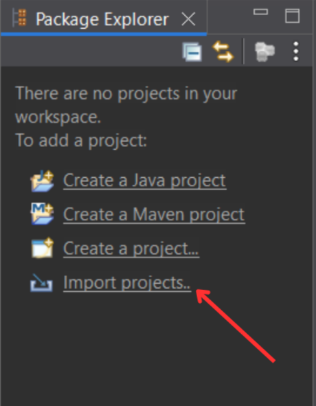
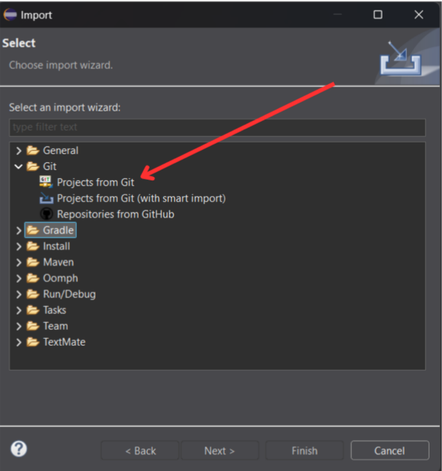
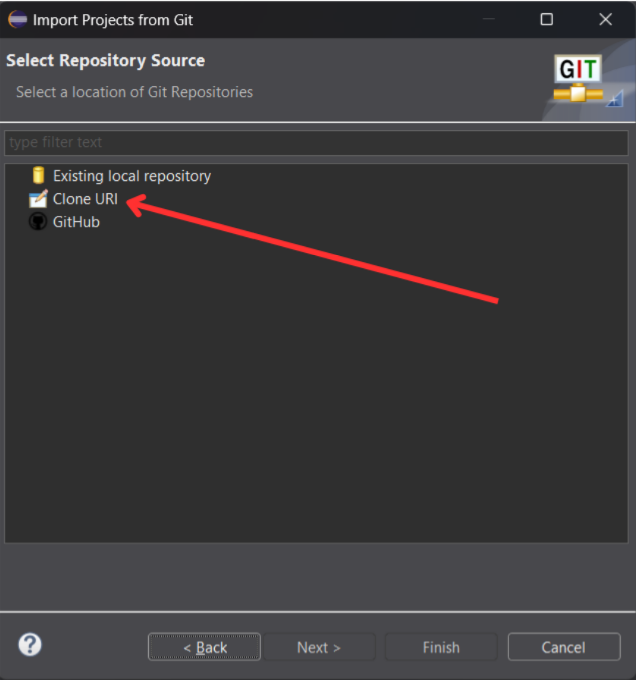
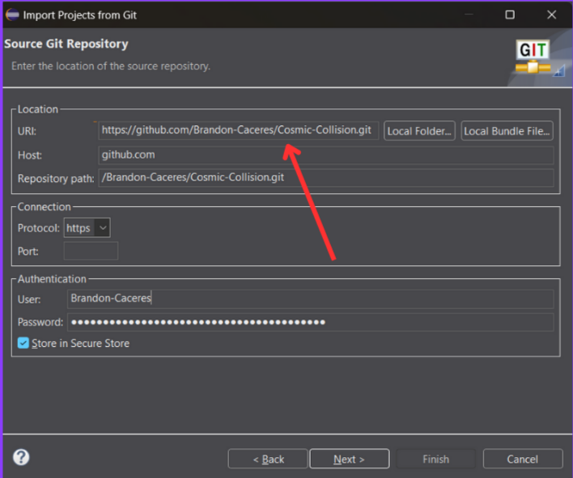
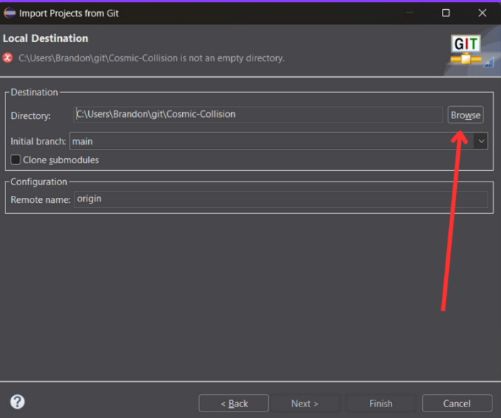
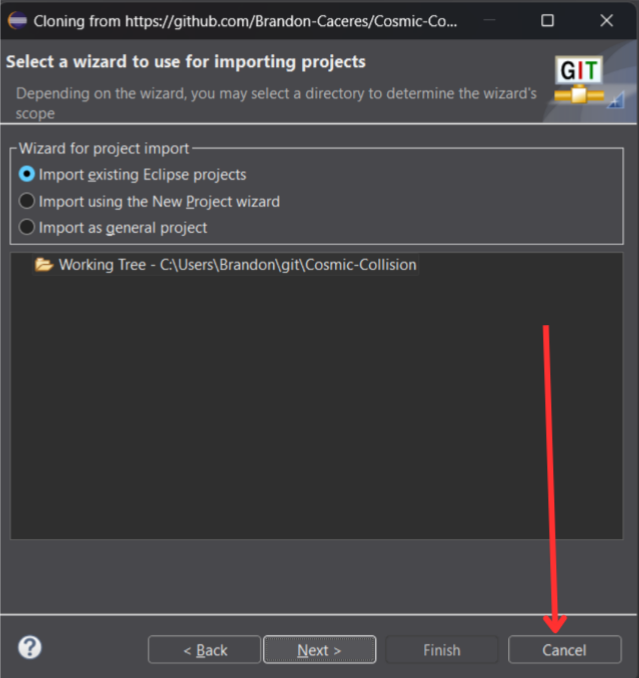
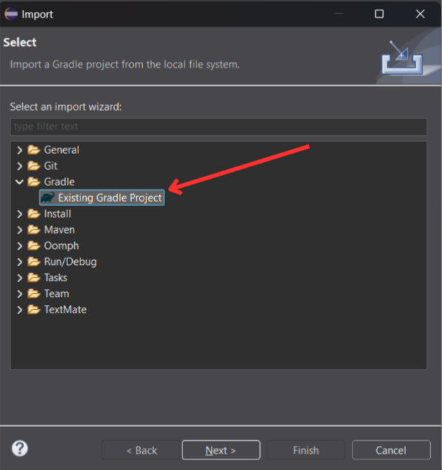
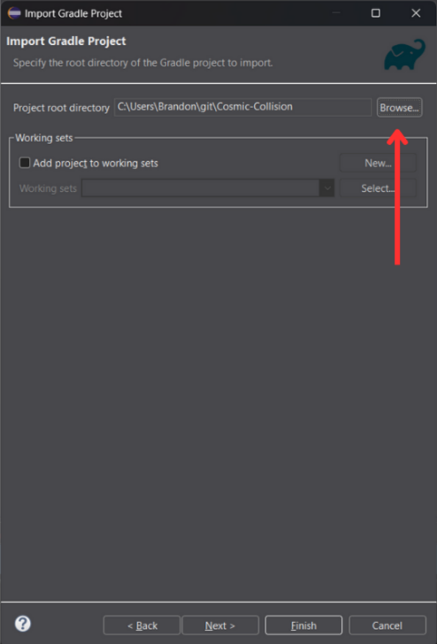
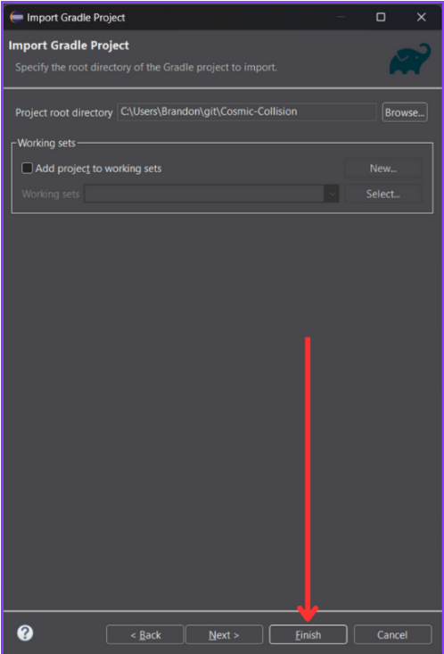
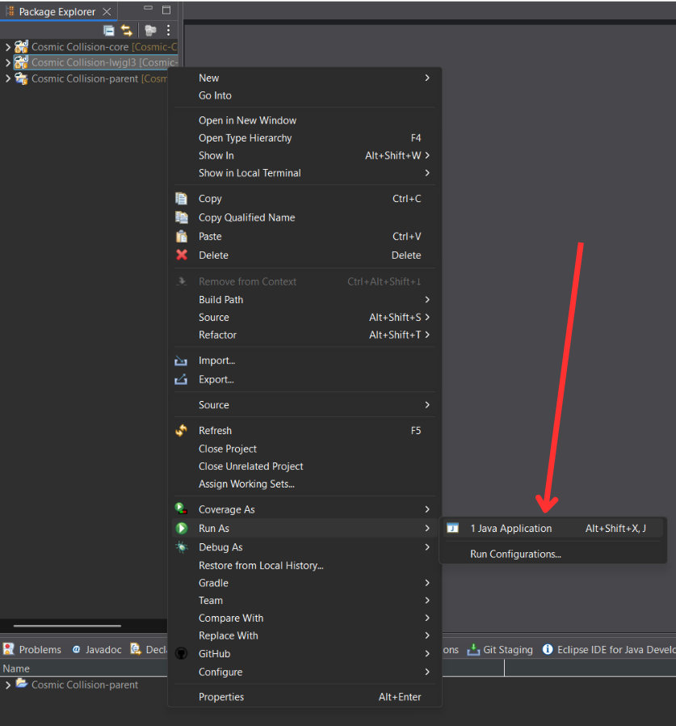

# Cosmic Collision — Importar el proyecto desde GitHub a Eclipse

Guía paso a paso para clonar el repositorio desde GitHub y abrirlo en Eclipse como proyecto Gradle (Buildship). Incluye capturas de referencia y la forma recomendada de ejecutar desde el módulo `lwjgl3` con clic derecho.

> Recomendado para Windows/macOS/Linux. Eclipse 2021‑09 o superior.

---

## Requisitos

- Eclipse IDE for Java Developers con:
  - EGit (cliente Git integrado en Eclipse).
  - Buildship: Gradle Integration (instálalo desde Eclipse Marketplace si no lo tienes).
- JDK 17 (o la versión que use tu proyecto).
- Acceso a GitHub:
  - HTTPS: usa un Personal Access Token (PAT) en lugar de contraseña.
  - SSH: agrega tu clave pública a GitHub.

Estructura del proyecto (Gradle multi-módulo):
- `core`: lógica del juego.
- `lwjgl3`: lanzador de escritorio (LWJGL3).
- Wrapper de Gradle en la raíz (`gradlew`, `gradlew.bat`, `gradle/wrapper/…`).

---

## 0) Abrir el asistente de importación desde el Package Explorer

- Si tu espacio de trabajo está vacío, haz clic en “Import projects..” en el panel Package Explorer.  
  Referencia:  
  

> También puedes ir por la ruta clásica: Eclipse > File > Import…

---

## 1) Clonar el repositorio con EGit

1. File > Import…  
   Selecciona: Git > Projects from Git > Next.  
   Referencia:  
   

2. Fuente del repositorio: elige “Clone URI” > Next.  
   Referencia:  
   

3. Pega la URL del repo y autentícate
   - URI (HTTPS): `https://github.com/Brandon-Caceres/Cosmic-Collision.git`  
     - Usuario: tu usuario de GitHub  
     - Password: tu Personal Access Token (PAT)  
   - Marca “Store in Secure Store” si quieres guardar credenciales.  
   - Next.  
   Referencia:  
   

4. Carpeta de destino local
   - Elige una carpeta vacía (por ejemplo: `C:\Users\<tu>\git\Cosmic-Collision`).  
   - Si Eclipse avisa “is not an empty directory”, crea una nueva carpeta totalmente vacía.  
   - Next.  
   Referencia:  
   

5. Cierra el asistente de importación de EGit
   - Si aparece “Select a wizard to use for importing projects”, pulsa “Cancel”.  
   - Importaremos como proyecto Gradle en el siguiente paso (más fiable para multi‑módulo).  
   Referencia:  
   

---

## 2) Importar como proyecto Gradle (Buildship)

1. File > Import…  
   Selecciona: Gradle > Existing Gradle Project > Next.  
   Referencia:  
   

2. Project root directory
   - Apunta a la carpeta raíz que acabas de clonar (p. ej., `C:\Users\<tu>\git\Cosmic-Collision`).  
   - Eclipse detectará los subproyectos (`core`, `lwjgl3`).  
   - Deja “Use default Gradle wrapper (recommended)”.  
   Referencia:  
   

3. Finish para completar la importación Gradle.  
   Referencia:  
   

---

## 3) Ejecutar el juego (Eclipse)

Opción A — Clic derecho en el módulo `lwjgl3` (recomendado en Eclipse):
1. En Package Explorer, clic derecho sobre el proyecto/módulo `Cosmic Collision-lwjgl3`.
2. Run As > Java Application.  
   - Si Eclipse pregunta qué clase ejecutar, elige `com.proyecto.juego.lwjgl3.Lwjgl3Launcher`.  
   Referencia:  
   

Opción B — Gradle Tasks (Buildship):
- Abre la vista “Gradle Tasks” (Window > Show View > Other… > Gradle > Gradle Tasks).
- Expande el módulo `lwjgl3`.
- Doble clic en la tarea `run`.

Opción C — Run Configuration (Gradle):
- Run > Run Configurations… > Gradle > Gradle Task.
- Project: selecciona el proyecto raíz.
- Tasks: `lwjgl3:run`
- Apply > Run.

---

## Solución de problemas (FAQ)

- No aparece “Run As > Java Application” al hacer clic derecho en `lwjgl3`
  - Clic derecho en el proyecto raíz y en `lwjgl3` > Gradle > Refresh Gradle Project.
  - Verifica que `Lwjgl3Launcher.java` existe en `lwjgl3` y contiene un método `public static void main`.
  - Revisa Project > Properties > Java Build Path por errores.

- “Destination is not an empty directory”
  - Selecciona una carpeta totalmente vacía para clonar o borra su contenido antes de continuar.

- Autenticación HTTPS fallida
  - GitHub no acepta contraseña clásica: crea un [Personal Access Token (PAT)](https://github.com/settings/tokens) y úsalo como “Password”.

- Módulos `core` / `lwjgl3` no aparecen
  - Importa desde la raíz del repo (no desde subcarpetas).
  - Clic derecho sobre el proyecto > Gradle > Refresh Gradle Project.

- Error de versión de Java
  - Asegura que Eclipse usa el JDK correcto (Project > Properties > Java Build Path / Project Facets).
  - Usa el wrapper de Gradle por defecto (no fuerces Gradle local).

- Windows: rutas demasiado largas
  - Clona en una ruta corta (`C:\git\Cosmic-Collision`) o habilita rutas largas en el sistema.

## Créditos y licencia

- Equipo de Cosmic Collision.  
- Eclipse EGit y Buildship.  
- Licencia: MIT (o la que corresponda al repositorio).
